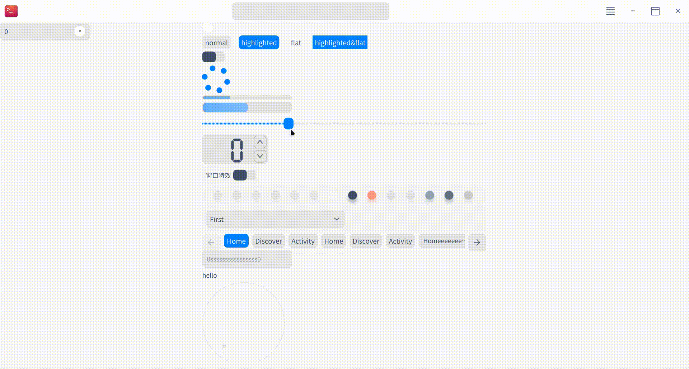

# Introduction

This is a QtQuick custom  style integrated from [DTK](http://github.com/linuxdeepin/dtkwidget).

Due to technical limits, till now only components in QtQuick.controls are integrated.

# Screenshots

*using dtk mainwindow and qquickwidget*

*using QtQuick ApplicationWindow*

You can simply open and build the project under example/ via Xmake or in Qt Creator.

# Build Dependencies
The project now uses [xmake](https://xmake.io) as build system, you can easily install xmake according to their instructions.

If DTK dependencies is installed, it'll link to dtk's apis, otherwise it'll use mocked dpalette etc. as fallback.

# Usage
1. include `src/include/qtquickdtk.h` in your main.cpp, call `enableQtQuickDTKStyle(QQmlEngine*)` before you show the qml widget or window
2. add the path where `DPalette/`(default built in xmake $buildir) locates to qml import path(by `addImportPath` function or `QML2_IMPORT_PATH` env)
    - this can be done by including `src/dtk.qrc` and add `:/` to qml import path
3. put `libdpalette.so` at shared lib load path

Within three steps you can use dtk-style qml controls!

Or you can only declare the type and include qmldpalette class, `import QMLDPalette 1.0` in .qml, write your own components with dtk color style.

# Example
Here're Python and C++ examples in `examples/`, its `xmake.lua` has been included in root dir so you can run `xmake [build|run] example-[cpp|python]` under this repo's root dir.
