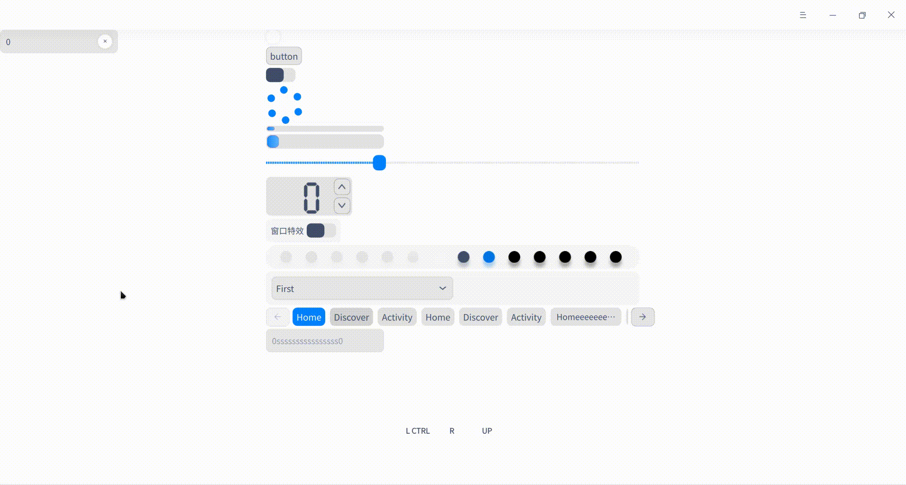

# Introduction

This is a QtQuick custom  style integrated from [DTK](http://github.com/linuxdeepin/dtkwidget).

Due to technical limits, till now only components in QtQuick.controls are integrated.

# Example

You can simply open and build the project under example/ in Qt Creator.

# Usage

- add dtk.qrc to your project
- include "qtquickdtk.h" in your main.cpp
- call `enableQtQuickDTKStyle(QQmlEngine*)` before you show the qml widget or window

Yes, just three steps you can use dtk-style qml controls!