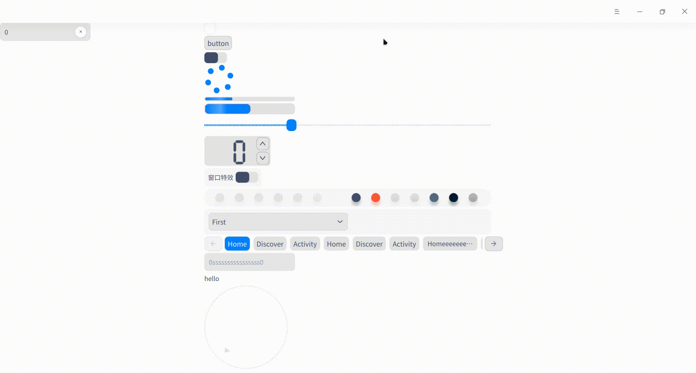

# Introduction

This is a QtQuick custom  style integrated from [DTK](http://github.com/linuxdeepin/dtkwidget).

Due to technical limits, till now only components in QtQuick.controls are integrated.

# Example

You can simply open and build the project under example/ in Qt Creator.

# Usage

- add `src/resources/dtk.qrc` and sources&headers in`src/include` to your project
- declare QMLDPalette type as a qml module
- include `src/include/qtquickdtk.h` in your main.cpp
- call `enableQtQuickDTKStyle(QQmlEngine*)` before you show the qml widget or window

Yes, within four steps you can use dtk-style qml controls!

Here's an example on qmake .pro file:

```makefile
SOURCES += \
        dtk/include/qmldpalette.cpp

RESOURCES += qml.qrc \
    dtk/resources/dtk.qrc
    
HEADERS += \
    dtk/include/qmldpalette.h \
    dtk/include/qtquickdtk.h
# register QMLDPalette C++ class to support module import in .qml
CONFIG += qmltypes
QML_IMPORT_NAME = QMLDPalette
QML_IMPORT_MAJOR_VERSION = 1

```

Or you can only declare the type and include qmldpalette class, `import QMLDPalette 1.0` in .qml, write your own components with dtk color style.